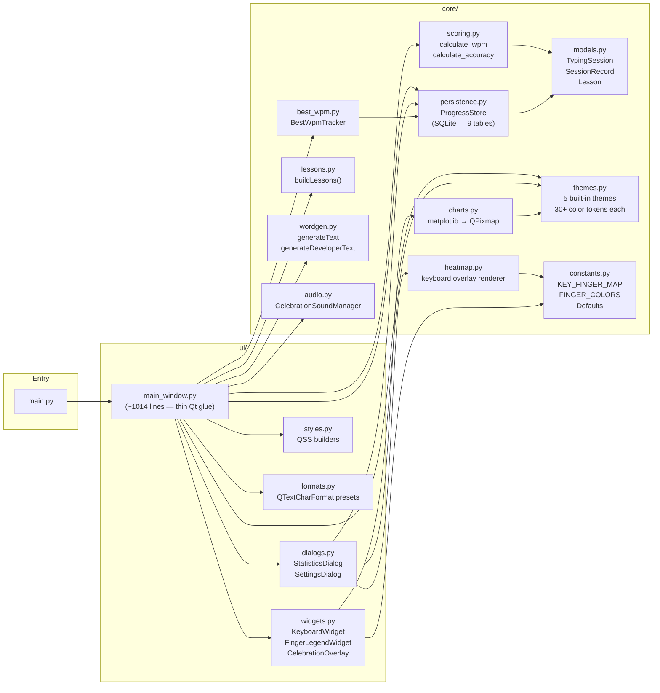
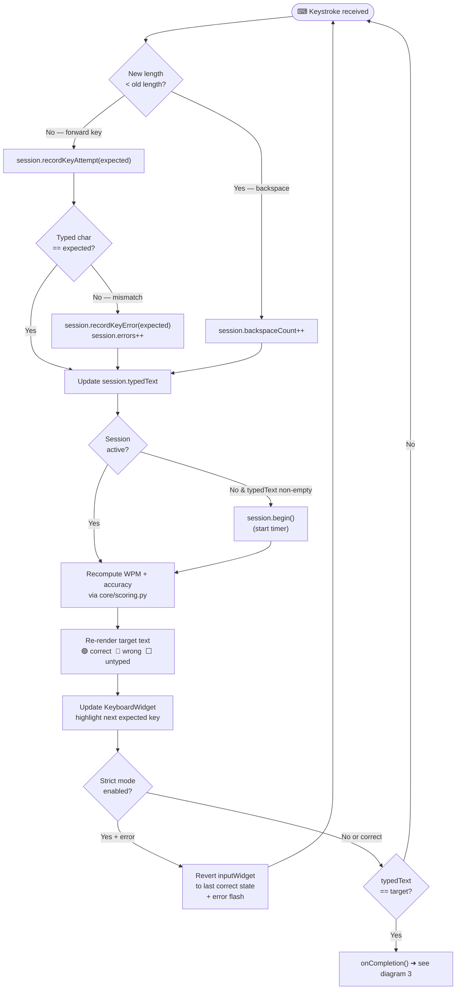
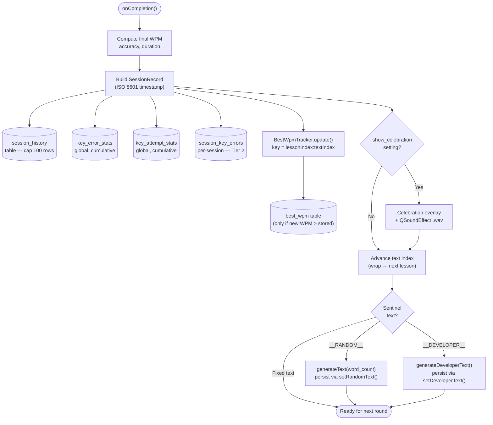
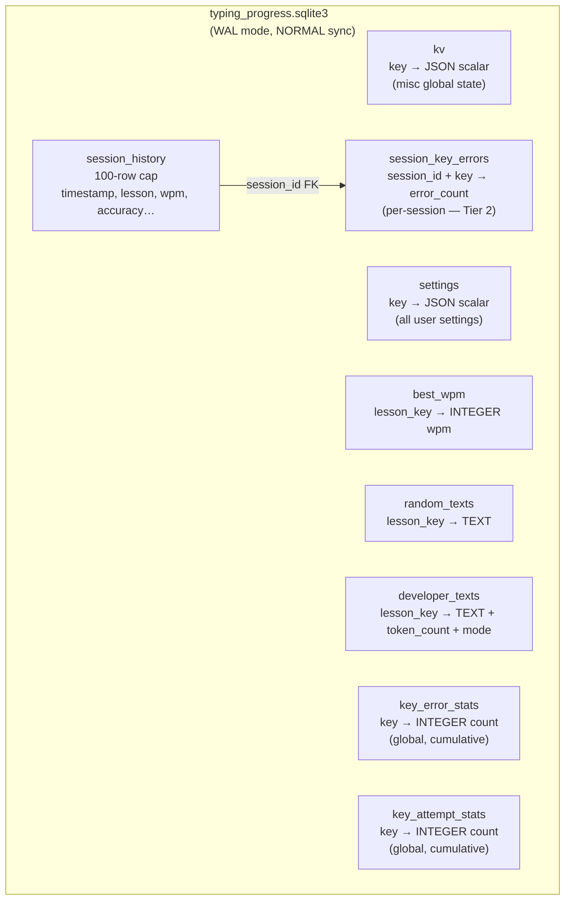
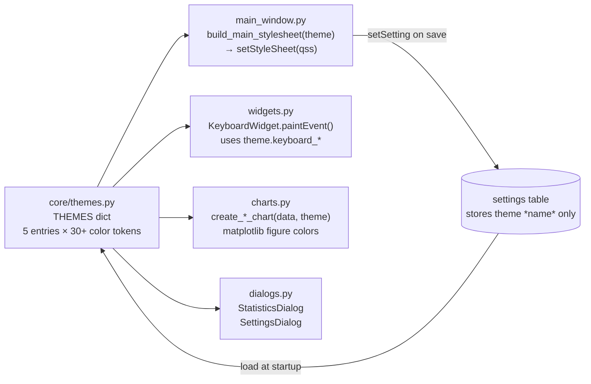

# Py-Typing — Visual Overview

> Diagrams derived from [[SPEC]], [[CHANGELOG]], and [[ENHANCEMENTS_ROADMAP]].
> Treat [[MASTER]] as the authoritative source; treat this file as the visual companion.

---

## 1. Module Architecture

How the Python (and C++ port) modules relate to each other. Arrows indicate a dependency or call direction.

---

## 2. Typing Session State Machine

The core keystroke loop from §8.2 of [[SPEC]]. Every key press in the input `QTextEdit` flows through this graph.

---

## 3. Session Completion & Persistence Flow

What happens the moment the user finishes typing the target text.

---

## 4. SQLite Schema Map

All 9 tables in `typing_progress.sqlite3` and what each stores.

---

## 5. Feature Roadmap

```mermaid
flowchart LR
    subgraph V13["v1.3 ✅ Shipped"]
        A1["scoring.py extracted\n14 tests"]
        A2["best_wpm.py extracted\n10 tests"]
        A3["SQLite migration\n(JSON → .migrated)"]
        A4["main_window.py split\nstyles · formats"]
    end

    subgraph V11["v1.1 ✅ Shipped"]
        B1["Theme system\n5 themes · 30+ tokens"]
        B2["Matplotlib charts\nWPM + accuracy"]
        B3["Error heatmap\n(global)"]
    end

    subgraph V12["v1.2 ✅ Shipped"]
        C1["session_key_errors\ntable added"]
        C2["Per-lesson\nheatmap filter"]
        C3["Error Trends tab\n(time-series)"]
    end

    subgraph T1["Tier 1 🔜 Next\n(no schema change)"]
        D1["Export charts\nas PNG"]
        D2["Pie + scatter\nchart types"]
        D3["Practice\nrecommendations"]
    end

    subgraph T3["Tier 3 📋 Later"]
        E1["Custom\ntheme creator"]
    end

    subgraph IDEAS["💡 Ideas (unscoped)"]
        F1["Adaptive drills"]
        F2["Bigram/trigram\nanalysis"]
        F3["Goal + streak\ntracking"]
        F4["Lesson gating\n(WPM unlock)"]
        F5["Import file/URL"]
    end

    V13 --> V12
    V11 --> V12
    V12 --> T1
    T1 --> T3
    T3 -.-> IDEAS
```

---

## 6. Theme Architecture

How a theme propagates from definition to every painted surface.

---

*All diagrams reflect the state documented in [[CHANGELOG]] and [[SPEC]]. Update this file whenever a new version ships or the module structure changes.*
